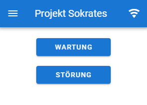
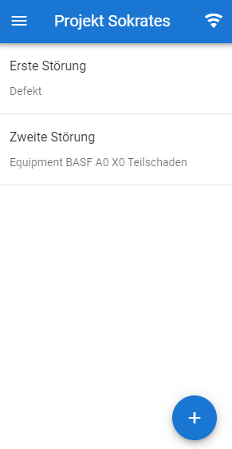
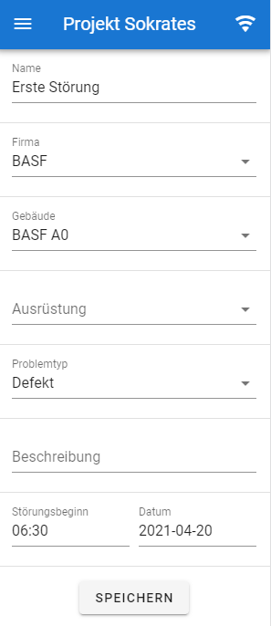
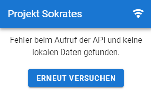

# Benutzerhandbuch
1. [Benutzung](#benutzung)
2. [Details](#details)

## Benutzung
In diesem Kapitel wird erklärt, wie die Applikation aufgebaut ist und welche Funktionalitäten gegeben sind.
### Startseite
 
Von der Startseite aus können Sie auf verschiedene Seiten weitergeleitet werden:
- Störungen
  - zeigt Auflistung aller Störungen
- Wartungen
  -  zeigt Auflistung aller Wartungen
-  Menü-Button (Oben-links)
    - öffnet Menü mit Navigationsmöglichkeit zu den hier genannten Seiten

Der Menü-Button in der obereren linken Ecke ist auf jeder der Teilseiten zu finden um eine Navigation einheitlich zu halten. 

Die Wlan-Anzeige in der rechten oberen Ecke zeigt an, ob Sie mit dem Internt verbunden sind, oder nicht. Wenn Sie nicht mit dem Internet verbunden sind, dann sollten Ihnen bis auf die Speicherfunktion noch alle anderen Funktionen zur Verfügung stehen.

### Störungen
 
Auf dieser Seite können alle Störungen, welche über den API Aufruf bekommen wurden abgerufen werden. Durch Klick auf die jeweilige Störung wird auf die Störungsdetailseite weitergeleitet.  
Unten rechts in der Ecke befindet sich ein zusätzlicher Button, welcher das Anlegen von neuen Störungen ermöglicht. Auch hierbei wird auf die Detailseite der neu erzeugten Störung weitergeleitet.
### Störungsdetails
 
Auf dieser Seite können Sie alle Details zur ausgewählten Störung ansehen und bearbeiten. Im Abschnitt zu den [Details](#details) werden die Einzelnen Attribute noch einmal detailiert erläutert.
### Wartung
 
 
Auf dieser Seite können alle persönlichen Wartungen angezeigt werden. Hierbei besteht auch die Möglichkeit sich die abgeschlossenen Wartungen durch den Switch `Anzeige der Historie` einzusehen, jedoch können diese nicht mehr verändern werden.
### Wartungsdetails
 
In den Wartungsdetails besteht die Möglichkeit Schäden, welche bei der Wartung aufgetreten sind zu hinterlegen, den Zeitraum anzugeben und optional Kommentare zu hinterlegen. Die anderen Felder dienen nur der Informationsgebung.

Hierbei sind jedoch die Angabe der Schäden und der Zeitraum Pflichtfelder.
 
Bereits abgeschlossene Wartungen können nicht weiter bearbeitet und verändert werden.
### Fehler
 
Wenn Sie auf dieser Seite gelandet sind kann dies zwei Ursachen haben:
- Keine Internetverbindung und keine lokalen Daten gefunden
- Die Api ist nicht erreichbar und es wurden keine lokalen Daten gefunden

Wenn Sie sichergestellt haben, dass das Problem behoben wurde, dann können Sie über den Button `Erneut versuchen` den Ladevorgang wiederholen.

## Details
Auf den Detail-Seiten der Wartung / Störung können Sie Angaben zu tätigen. Um zu erläutern, welches Feld wie ausgefüllt werden sollte wird im Folgenden erklärt, was für einen Hintergrund welches Feld mit sich bringt. Änderungen werden erst übernommen, wenn final der Speichern-Button geklickt wird, ansonsten werden getroffene Änderungen beim Verlassen der Seite wieder verworfen.
### Name
Der Name der Störung. Dieser wird ebenfalls in der Liste aller Störungen präsentiert, daher ist es zu empfehlen einen sprechenden, aber auch präzisen Name zu wählen.
Der Name muss nicht eindeutig sein, da intern eine ID zum identifizieren der Störungen verwendet wird. Bei dem Namen handelt es sich um das einzige Pflichtfeld.
### Firma
Die Firma, welche durch die entdeckte Störung betroffen wird. Bei diesem Feld werden die Auswahlmöglichkeiten vorgegeben.
### Gebäude
Kann nur ausgewählt werden, wenn eine Firma ausgewählt wurde. Auch hier werden die Antwortmöglichkeiten vorgegeben, jedoch werden diese vorher noch nach Firma gefiltert, sodass nur Gebäude der ausgewählten Firma angezeigt werden.
### Ausrüstung
Folgt dem selben Prinzip wie die Gebäude. Firma und Gebäude müssen ausgewählt sein und die Antwortmöglichkeiten werden vorgefiltert.
### Problemtyp
Hier kann eine Angabe getroffen werden, um was für eine Art Problem es sich handelt. Anhand dieser Information können Störungen besser auf Techniker verteilt werden.
### Beschreibung
Hier wird die Möglichkeiten geboten weitere Informationen zur Störung bereitzustellen.
### Beginn und Datum
Durch Klick auf die Eingabefelder werden Dialoge geöffnet, welche die Auswahl von Zeit / Datum ermöglichen. Es handelt sich hierbei um die Angabe der Zeit, zu welcher die Störung erkannt worden ist.
### Beginn / Ende der Wartung
Durch Klick auf die Eingabefelder werden Dialoge geöffnet, welche die Auswahl von Zeit / Datum ermöglichen. Es handelt sich hierbei um den Zeitraum, welche für die Fertigstellung der Wartung benutzt wurde.
### Schäden
Hier sollen Schäden, welche bei der Wartung aufgefallen sind hineingeschrieben werden.
### Kommentare
Hier wird die Möglichkeit geboten Kommentare zu einer Wartung zu geben, beispielsweise einen Zeitraum für eine Instandhaltung oder einer weiteren Wartung.