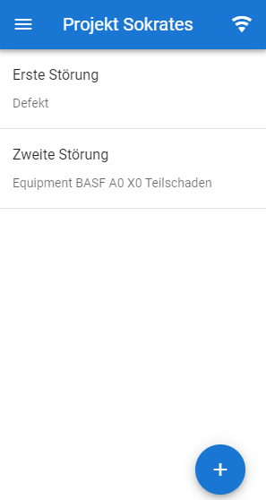

# Benutzerhandbuch
1. [Benutzung](#benutzung)
2. [Details](#details)

## Benutzung
In diesem Kapitel wird erklärt, wie die Applikation aufgebaut ist und welche Funktionalitäten gegeben sind.
#### Startseite

Hier kommt text hin

## Details
