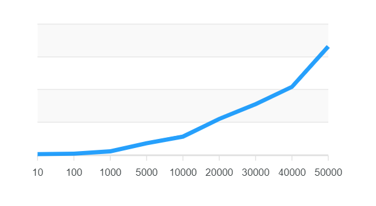

1. [Anforderungen](#anforderungen)
2. [Technologie](#technologie)
3. [Performance](#performance)
4. [Selbsteinschätzung](#selbsteinschätzung)

## Anforderungen

### Fachlich
- Herunterladen: Stammdaten und Transaktionsdaten
- Erfassung / Upload: Status, Stammdaten, Zeiten, Materialien
- Kollaboration: Wissensdatenbanken, Abstimmung mit anderen Technikern
- Innovativ: Augmented Reality, Gamification, …
- Beindruckend

### Technisch
- Lauffähig unter Windows 10, iOS und Android
- Formfaktor: Tablet und Smartphone
- Offline
- Synchronisation im Hintergrund
- Screen Response und UX

## Technologie

### Geplant
- React Native Frontend (Cross-Plattform Application)
- Postman

### Umgesetzt
- Vue.js (PWA / Progressive Web App)
- Postman

## Performance
 
Um die Performance und Kapazität der Applikation zu bestimmen wurden die erlangten Datensätze temporär auf bestimmte Meilensteingrößen dupliziert. Die Größe der Datensätze kann auf der X-Achse erkannt werden. Begonnen wurde mit 10 Störungen und die maximale ausgewertete Größe wurde mit 50000 gesetzt. Durch hovern über den Graph lässt sich ebenfalls der genaue y-Wert ablesen (in der Applikation). Dieser beschreibt die Zeit, welche es vom Holen und Erstellen der Daten zum fertiggestellten Rendern benötigt. Bei 10 Datensätzen liegt der Wert noch bei ca. 415 MS, doch steigt bei 50000 auf ca. 66 Sekunden an. Bei Werten von über 50000 kommt es regelmäßig zu `Out of memory errors`, was uns dazu veranlagt hat, die maximal praktische Datensatzgröße von 50000 anzusetzen.

#### Ausblick und Vorschläge
Hauptaufwand beim handhaben dieser großen Datensätze ist ganz eindeutig das rendern der Frontend-Elemente der Liste. Um diesen großen Rechenaufwand zu vermindern, gibt es zwei Möglichkeiten:
- Prefiltering der Störungen durch Angaben von Namen / ID oder anderen Key-Eigenschaften
- Lazy-Loading ( Laden von nur den Elementen, welche zum aktuellen Zeitpunkt auch im Frontend angezeigt werden)

Weitere Verbesserungsvorschläge:
- Eingabeüberprüfungen
- schönere UI

## Selbsteinschätzung
Note: 42/50  
Grundbaustein sehr ausbaufähig und durchdacht (Gutes Feherhandling, Datenstrukturierung, Skalierbarkeit), jedoch eingeschränkte Funktionalität resultierend aus einer kleinen Gruppengröße. Restriktionen und Verbesserungsmöglichkeiten erläutert, jedoch aufgrund von Zeitmangel nicht umgesetzt.
Gruppenentscheidung dafür, dass jedes Mitglied die gleiche Note bekommt, da zumindest der selbe zeitmäßige Aufwand getätigt wurde.  
#### Themenhauptpunkte Rouven:
- Technologierecherche und Entscheidung ( Vorerfahrungen )
- API 
- Wartungsprozess
#### Themenhauptpunkte Lukas:
- Fehlerhandling
- Grundbaustein Applikation
- Störungsprozess
